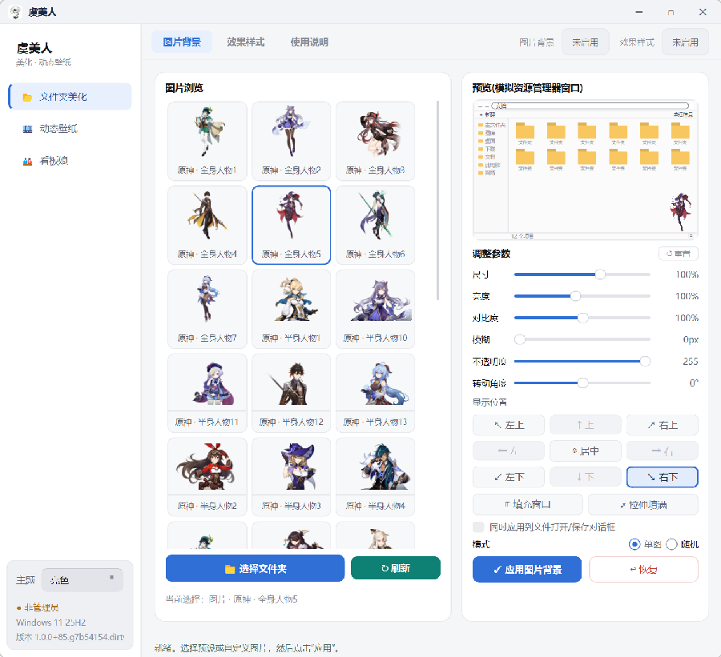
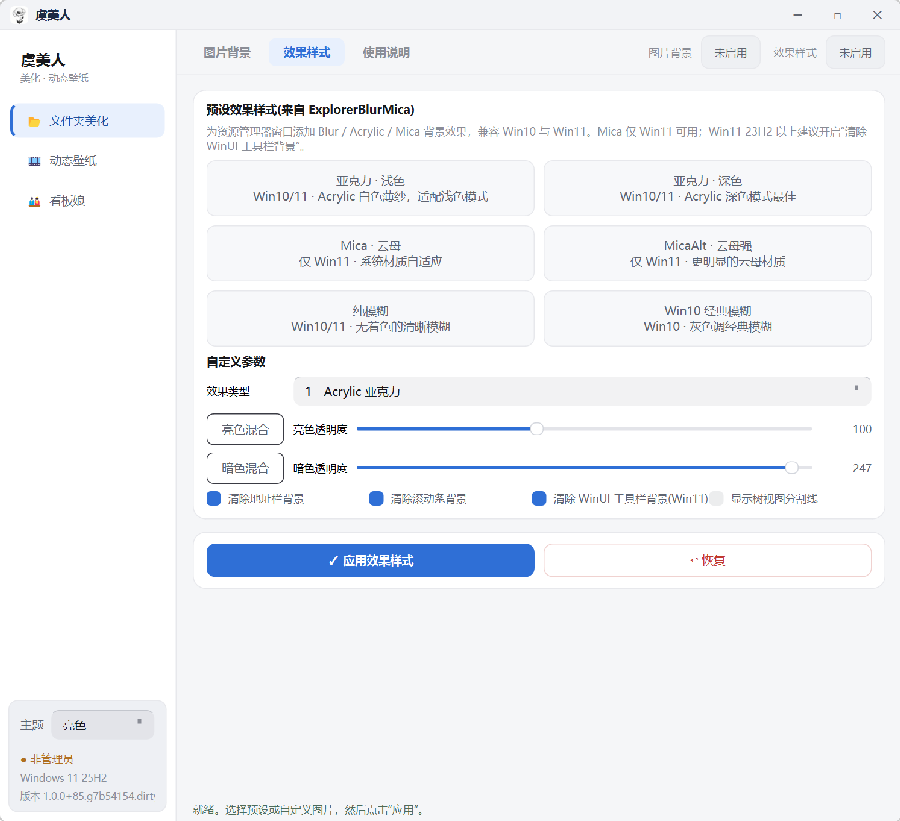
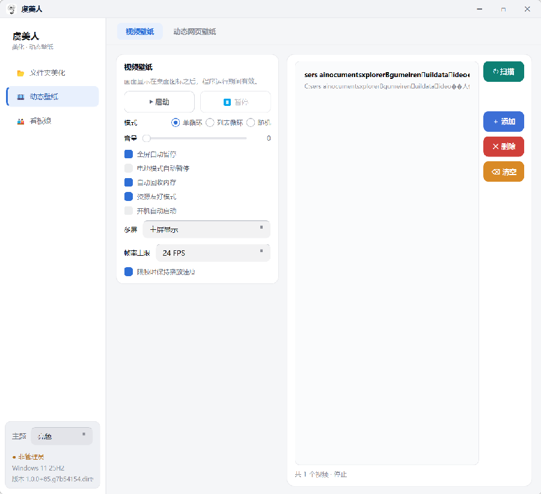
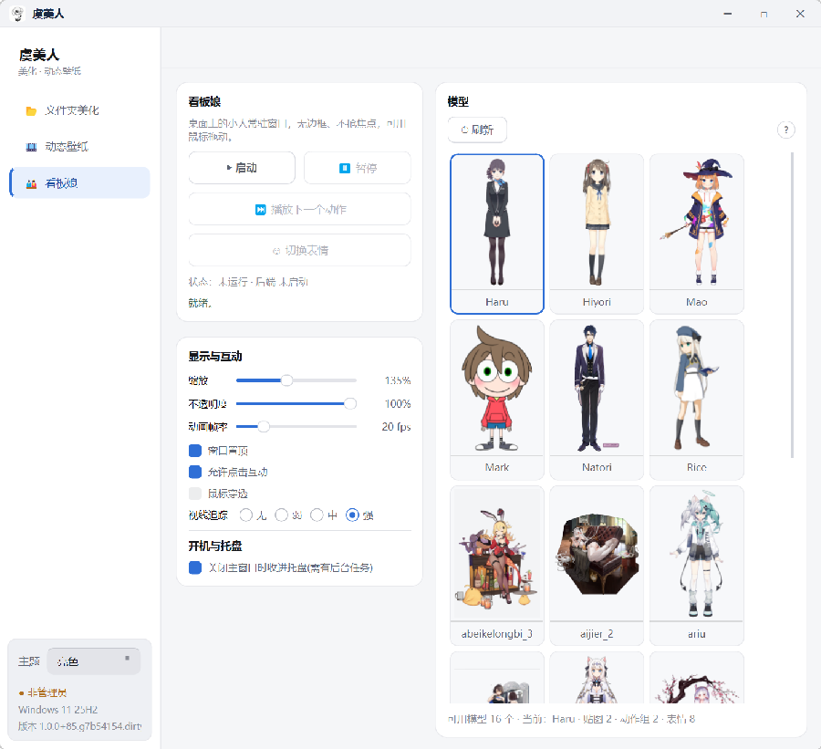
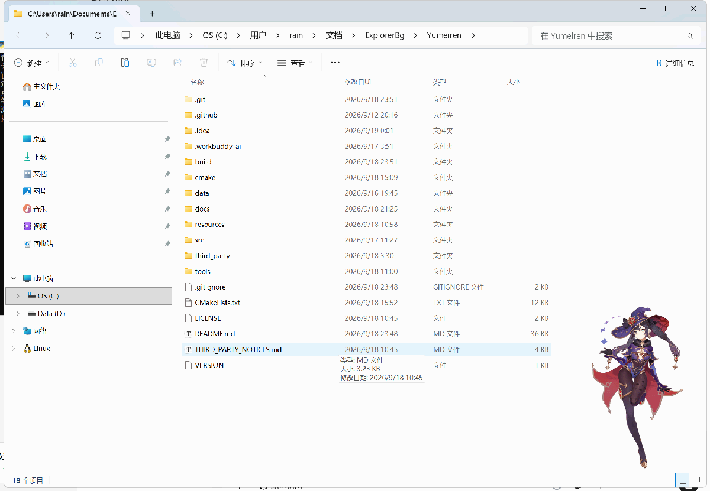
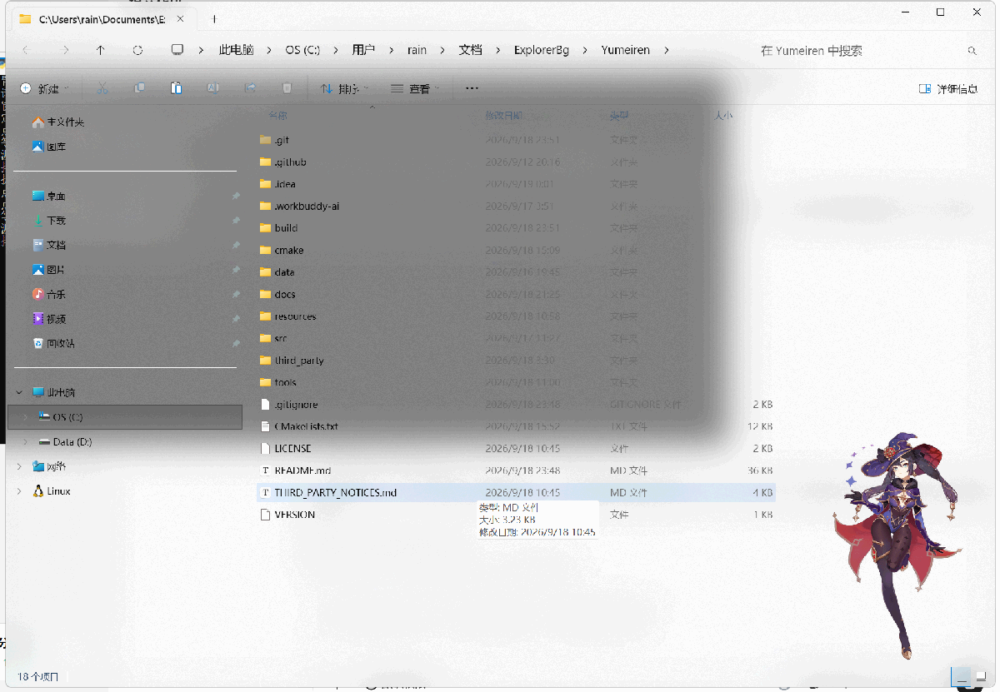
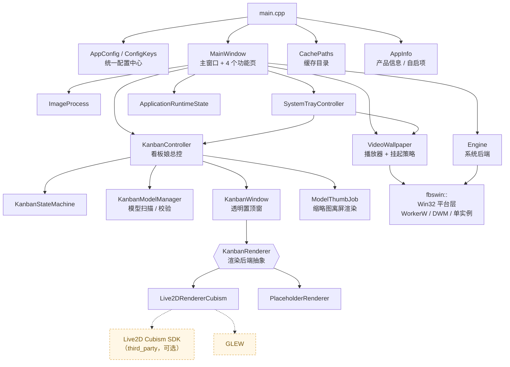

# 虞美人 · Yumeiren

[](https://github.com/weiraing/Yumeiren/actions/workflows/release.yml)
[](https://github.com/weiraing/Yumeiren/releases)


[](LICENSE)
[](https://github.com/weiraing/Yumeiren/commits)

**虞美人**是一个面向 Windows 10 / 11 的桌面美化工具，把三件通常要装三个软件的事做进了同一个应用：

<table>
<tr>
<td width="33%" valign="top">

**🖼 文件夹背景美化**

给每个资源管理器窗口换上自定义图片背景，并叠加 Blur / Acrylic / Mica 系统级窗口效果。

</td>
<td width="33%" valign="top">

**🎬 视频动态壁纸**

把视频挂载到桌面图标层之后播放，带播放列表、播放模式、智能暂停与资源优化。

</td>
<td width="33%" valign="top">

**🎎 看板娘**

Live2D Cubism 驱动的无边框透明桌面宠物，常驻桌面、可拖动、可互动、会看向你的鼠标。

</td>
</tr>
</table>



> 程序在任务栏与窗口标题中显示为 `Yumeiren`，进程描述为「虞美人」。

## 目录

- [✨ 功能特性](#-功能特性) · [🖥 实际效果](#-实际效果) · [🚀 安装使用](#-安装使用)
- [🛠 从源码构建](#-从源码构建) —— **编译不通过就看这一节**
- [🔖 版本号与发布](#-版本号与发布) —— **版本号怎么改、怎么发版**
- [📊 项目统计](#-项目统计) · [📁 目录结构](#-目录结构) · [⚙️ 配置与数据目录](#️-配置与数据目录)
- [🩺 诊断与验证工具](#-诊断与验证工具) · [📚 设计文档](#-设计文档) · [🙏 致谢与许可](#-致谢与许可)

---

## ✨ 功能特性

### 🖼 文件夹美化 —— 图片背景

- 一键把任意图片设为**所有资源管理器窗口**的背景。图库自动**递归**扫描 `<程序目录>/data/image`（按子目录分好的图集也一并收进），也可选自定义图片 / 目录，带后台缩略图。
- 实时调节旋转、缩放、亮度、对比度、模糊、不透明度，7 种显示位置（填充 / 居中 / 拉伸 + 四角）。
- 可勾选「叠加全窗口效果」：图片覆盖文件列表区、模糊 / 亚克力覆盖整个窗口，合成完整背景；也可扩展到**文件打开、保存对话框**。点「恢复」即可**完全卸载**，不留残余。


### 🎨 文件夹美化 —— 效果样式

- 基于 [ExplorerBlurMica](https://github.com/Maplespe/ExplorerBlurMica) 2.0.1，为资源管理器窗口添加 **Blur / Acrylic / Mica / MicaAlt** 系统级背景效果，亮暗色模式自适应。
- 亮色 / 暗色两套颜色与透明度**独立可调**；细节开关：清除地址栏背景、清除工具栏背景、清除 WinUI 控件背景、显示分隔线。



### 🎬 动态壁纸 —— 视频壁纸

- 播放列表管理（添加文件 / 扫描 `<程序目录>/data/video`）、播放 / 暂停 / 停止、双击立即切换曲目，音量可调。
- **三种互斥播放模式**（启动按钮下方「模式」行单选）：

  | 模式 | 行为 |
  | --- | --- |
  | **单循环**（默认） | 只播列表里选中的那一个视频，播完从头再来 |
  | **列表循环** | 按列表顺序一个接一个播，播完最后一个回到第一个 |
  | **随机** | 随机挑一个视频作为壁纸，播完再随机挑下一个 |

- 视频渲染在**桌面图标层之后**（WorkerW 挂载），不遮挡图标与文件。视频壁纸铺在主显示器上，显示器拓扑变化后自动重挂载。
- **智能暂停**：前台全屏应用、系统锁定、显示器熄屏、电池供电、桌面被完全遮挡时自动挂起，恢复后自动续播。
- **资源友好**：帧率上限默认 24 fps（高帧率素材以慢动作播放），4K60 素材内存 / 显存约 **−40%**；「限制逻辑核」默认开启（限前 4 个逻辑核），实测 1080p30 内存约 **−27%**、显存约 **−36%**、CPU 不变；长时间挂起自动卸载解码管线，恢复时跳回暂停位置。
- **可靠性**：单视频无缝循环、坏曲目自动跳过、资源管理器重启后自动修复挂载、单实例守卫；支持开机自启，`YUMEIREN_DIAG=1` 输出分阶段诊断日志。



### 🎎 看板娘（桌面宠物）

- 基于 **Live2D Cubism Native SDK 5 R.5（Core 6.0.1）** 渲染，无边框 + **逐像素透明**的置顶小窗，不进任务栏、不抢焦点；关闭即隐藏，反复启停不重建窗口。
- **完整还原模型能力**：待机动作循环、点击 / 悬停反馈、视线跟随鼠标、表情切换，物理与姿态（`Physics` / `Pose` / `EyeBlink` / `Breath` / `Look`）全部挂到模型上。
- **命中区联动**：点**头部**给表情反馈（随机且避开当前这张），点**身体**播 `TapBody` 一类的动作组 —— 命中区名字对不上时退化为表情，保证「点了必有反应」。
- **三个入口都能切表情**：右键菜单、设置页按钮、点击头部。模型没有表情文件时入口**自动置灰并写明原因**，不做成点不动的死按钮。
- 模型管理：自动扫描 `<程序目录>/data/models`（每个子目录一个模型），带校验（贴图 / 动作组 / 表情计数），可一键切换或随机换下一个；设置页以**缩略图墙**展示，预览图由程序**另起一个进程**离屏渲染（`虞美人.exe --render-model-thumbs`）并缓存到 `.cache/model-thumbs/`。
- 缩放（滚轮 / 滑块）、不透明度、帧率上限、窗口置顶、鼠标穿透、允许点击互动、**视线追踪四档强度**，全部即时生效并落盘；主界面的显示 / 隐藏**不影响**看板娘动画。
- **按清单隐藏网格**：模型目录里放一份 `<模型名>.hidden.json`（配套的模型查看器 `tools/live2d-part-inspector` 导出的那份原样可用），里面列出的**部件**（连同整棵子树）与**单个网格**会被直接跳过绘制 —— 水印、免费版残留这类只在少数网格上的东西不必再改素材。看板娘页有总开关（`kanban/meshHide`，默认开），关掉即完全照模型原样显示、不改动任何文件；清单在装载模型时读一次，改完文件重开看板娘即可生效。
- **降级路径**：Live2D 不可用时自动切到内置的 QPainter 占位角色（会呼吸、眨眼、跟随视线，也有表情），界面行为不因后端不同而缩水。



### 🌐 动态网页壁纸

🚧 功能开发中，当前版本为界面预览。

---

## 🖥 实际效果

### 资源管理器：图片背景



### 资源管理器：再叠加 Acrylic 效果样式

同一个窗口叠加亚克力后整体变成半透明毛玻璃，地址栏与工具栏的底色被清空：



### 视频壁纸挂在桌面上

渲染在桌面图标层之后，不遮挡图标与文件：


### 看板娘站在桌面上


> 以上均为本机实拍：界面图为浅色主题、窗口 983×873；效果图为 2560×1600 @ 150% 缩放。

---

## 🚀 安装使用

1. 到 [Releases](https://github.com/weiraing/Yumeiren/releases) 下载 `Yumeiren-portable-vX.X.X-win64.zip`，解压到任意目录（免安装，Qt 运行时已内置）。
2. 运行 `虞美人.exe`，同意 UAC 管理员授权（写入配置、注册 Hook DLL、重启资源管理器均需要）。
3. 在「文件夹美化」页选择图片与效果，点击**应用**，打开任意文件夹查看效果；不想要了点击**恢复**即可完全卸载。

> ⚠️ 程序需以管理员身份运行（清单里写死了 `requireAdministrator`）；杀软若误报属于此类
> shell 注入工具的常见情况，可添加信任。

**使用须知**

- **单实例**：程序用会话级命名互斥体 `Local\Yumeiren.single-instance` 做守卫。已经开着 `虞美人.exe` 时，再双击（包括 `YumeirenTest.exe`、别的目录的副本）都不会开出第二个实例，而是**唤起已有窗口**后自己退出。
- **素材自备**：Live2D 模型、图片图库、视频都放在程序目录的 `data/` 下，仓库不含这些素材。
- **看板娘无表情时**：部分模型本身不含表情文件，相关入口会置灰 —— 这是素材问题，不是功能故障。

**常见问题**

| 现象 | 处理方式 |
| --- | --- |
| Windows 大版本更新后背景消失 | 重新点击「应用」即可 |
| 资源管理器窗口无法打开 | 按住 **ESC** 键点击资源管理器可跳过背景加载，然后在本工具点击「恢复」 |
| 「主页 / 图库」页看不到背景 | 属正常现象，进入任意文件夹查看 |
| 提示「旧目录注册（需重新应用）」 | Hook DLL 的绝对路径登记在 `HKLM` 的 CLSID 里，程序换过目录后注册表仍指向旧路径，点一次「应用」（需同意 UAC）即可重新注册 |
| 看板娘不显示模型 | 检查 `<程序目录>/data/models/<模型名>/` 下是否有 `*.model3.json` 与贴图；再看 `.cache/logs/videowallpaper.log` |

---

## 🛠 从源码构建

### 依赖总览

| 依赖 | 必需？ | 说明 |
| --- | :---: | --- |
| **Windows 10 / 11 x64** | ✅ | 项目大量使用 Win32（DWM / WorkerW / Shell 扩展注册） |
| **CMake ≥ 3.21** | ✅ | 用到 `qt_add_executable`、`$<TARGET_RUNTIME_DLLS>` |
| **Qt 6.10.2**（Widgets / Multimedia / MultimediaWidgets） | ✅ | CI 用 MSVC 2022 64 位；MinGW 亦可 |
| **MSVC 2022 或 MinGW-w64** | ✅ | 二选一，见下面的编译路线 |
| **Qt OpenGL / OpenGLWidgets** | ⬜ | 仅 Live2D 后端需要，CMake 会自动 `find_package` |
| **支持 OpenGL 3.3 的显卡驱动** | ⬜ | 看板娘用；不可用时自动降级为软件占位渲染 |
| `third_party/cubism` + `third_party/glew` | ⬜ | 决定有没有**真 Live2D**。缺失则自动降级为占位角色，**不影响编译** |
| `data/`（模型 / 图片 / 视频） | ⬜ | 决定有没有素材。缺失则图库为空、看板娘无模型 |

> `resources/dlls/` 下的两个 Hook DLL **已随仓库提供**，无需额外下载。

### 1. 安装 Qt 6

用 [Qt Online Installer](https://www.qt.io/download-qt-installer) 安装 **Qt 6.10.2**，在组件树里勾上：

```
Qt 6.10.2
├── MSVC 2022 64-bit          ← 或 MinGW 13.1 64-bit，与你选的编译器一致
├── Qt Multimedia             ← 必需（视频壁纸）
└── Qt Shader Tools           ← 必需（Qt 6 的 RHI 上屏路径依赖它）
```

装完记下路径，后面要填进 `CMAKE_PREFIX_PATH`：MSVC 形如 `C:/Qt/6.10.2/msvc2022_64`，
MinGW 形如 `C:/Qt/6.10.2/mingw_64`。

### 2. 获取源码并编译

```bash
git clone https://github.com/weiraing/Yumeiren.git
cd Yumeiren
```

**关键点是让 CMake 找到 Qt**，靠 `CMAKE_PREFIX_PATH` 指到上一步记下的路径。两条路线任选其一：

```bat
:: 路线 A：MSVC 2022（与 CI 一致，推荐）
::   在「x64 Native Tools Command Prompt for VS 2022」里执行
cmake -S . -B build -G "Visual Studio 17 2022" -A x64 -DCMAKE_PREFIX_PATH="C:/Qt/6.10.2/msvc2022_64"
cmake --build build --config Release --target Yumeiren
::   产物：build/Release/虞美人.exe（多配置生成器会多一层配置名目录）

:: 路线 B：MinGW + Ninja（开发期迭代快，先把 MinGW 与 Ninja 加进 PATH）
cmake -S . -B build -G Ninja -DCMAKE_BUILD_TYPE=Release -DCMAKE_PREFIX_PATH="C:/Qt/6.10.2/mingw_64" -DCMAKE_C_COMPILER=gcc -DCMAKE_CXX_COMPILER=g++
cmake --build build --target Yumeiren
::   产物：build/虞美人.exe
```

> ⚠️ `.gitignore` 排除了 `third_party/`、`data/`、`tools/` 与 `build*/` ——
> **克隆下来的是一个「没有 SDK、没有素材」的干净检出**。这没关系：CMake 会探测到 SDK 缺失
> 并自动走占位渲染路径，直接就能编译。
>
> MinGW 的一个已知差异：Cubism **Core 官方只提供 MSVC 的 `.lib`/`.dll`**。本项目不去链 MSVC
> 导入库（CRT 不匹配），也不用 `gendef + dlltool` 现场生成 `.a`（部分 MinGW 发行版不带这套
> 工具），而是**把 `.dll` 直接放到链接行上** —— GNU ld 会自己读 PE 导出表。这些都已在
> `cmake/Live2DCubism.cmake` 里处理好。

### 3. （可选）准备 `third_party/` 与 `data/`

想要真正的 Live2D 看板娘、想要有素材，就按下面的**固定目录结构**摆放：

```
third_party/
├── cubism/                 # Live2D Cubism Native SDK 5 R.5
│   ├── Framework/
│   └── Core/               # 官方只提供 MSVC 的 .lib/.dll
└── glew/                   # GLEW 2.3.1 源码
    ├── include/GL/glew.h
    └── src/glew.c

data/
├── models/                 # 每个模型一个子目录，内含 *.model3.json + 贴图/动作/表情
├── image/                  # 图片图库（递归扫描，可按主题分子目录）
└── video/                  # 动态壁纸的默认视频目录（递归扫描）
```

| 组件 | 下载地址 |
| --- | --- |
| Cubism Native SDK | <https://www.live2d.com/en/sdk/download/native/>（选 Native，版本 5 R.5 / Core 6.0.1） |
| GLEW 源码 | <https://github.com/nigels-com/glew/releases>（下 `glew-2.3.1.tgz` 的 **source** 包） |

**校验 SDK 是否摆对** —— 下面两个文件必须存在，CMake 就是靠它们探测的：

```bash
test -f third_party/cubism/Framework/src/CubismFramework.cpp && echo "cubism OK"
test -f third_party/glew/src/glew.c && echo "glew OK"
```

两处都 OK → CMake **默认打开** `YUMEIREN_WITH_LIVE2D`；任一缺失 → **默认关闭**，编译
`src/kanban/Live2DRendererStub.cpp`（占位渲染），构建照常通过。SDK 也可以放在仓库外，用
`-DYUMEIREN_CUBISM_SDK=<路径>` / `-DYUMEIREN_GLEW_ROOT=<路径>` 指过去。`data/` 则由 CMake 在
**首次构建**时整个拷到输出目录（已存在则跳过，避免覆盖你的改动；想强制重拷就删掉输出目录里的 `data/`）。

> SDK 受**专有许可**约束，仓库不提交它 —— 详见 [THIRD_PARTY_NOTICES.md](THIRD_PARTY_NOTICES.md)。

### 4. 常用 CMake 选项

| 选项 | 默认 | 说明 |
| --- | --- | --- |
| `CMAKE_PREFIX_PATH` | 空 | **必填**，指向 Qt 安装目录（如 `C:/Qt/6.10.2/msvc2022_64`） |
| `YUMEIREN_VERSION` | 空 | 显式指定版本号，覆盖 git 标签与 `VERSION` 文件（详见[版本号与发布](#-版本号与发布)） |
| `YUMEIREN_WITH_LIVE2D` | 探测 | 显式 `ON`/`OFF` 覆盖探测结果。想验证降级路径就传 `OFF` |
| `YUMEIREN_CUBISM_SDK` | `third_party/cubism` | Cubism SDK 根目录（需含 `Framework/` 与 `Core/`） |
| `YUMEIREN_GLEW_ROOT` | `third_party/glew` | GLEW 源码根目录（需含 `include/GL/glew.h` 与 `src/glew.c`） |
| `YUMEIREN_VERSION_FILE` | `<源码目录>/VERSION` | 版本号来源文件（内容一行 `X.Y.Z`） |
| `CMAKE_BUILD_TYPE` | 空 | 仅单配置生成器（Ninja / Makefile）需要，用 `Release` |

> 改了 CMake 选项记得**删掉 `build/CMakeCache.txt`** 或换一个新构建目录，否则缓存的旧值会继续生效。

### 5. 跑起来

CMake 已经帮你把 **Qt 模块 DLL 与 `platforms/qwindows.dll` 插件**自动拷到 exe 旁边（用
`$<TARGET_RUNTIME_DLLS>` 把传递依赖也一并带上），所以**构建完可以直接双击运行**，不需要先手工跑
`windeployqt`。

| 目标 | 提权 | 用途 |
| --- | :---: | --- |
| `build/.../虞美人.exe` | 需管理员 | 正式版，内嵌 `requireAdministrator` 清单与版本资源 |
| `build/.../YumeirenTest.exe` | 不需要 | 同源码同资源但**不带提权清单**，供自动化 UI 测试用 |

> 两个 exe 共用同一份 `config/.ini` 与 `.cache/`，所以**不要同时运行**。另外 `YumeirenTest.exe`
> 因为没有清单，窗口会带系统标题栏 / 边框，比正式版宽 15 像素、高 38 像素 —— 做尺寸 A/B 对比时
> 别跨这两个 exe。

只在自己机器上跑可以跳过打包；要做发布包才需要 `windeployqt`（它会补齐 `imageformats/`、
`multimedia/`、`styles/` 等 CMake 没搬的插件目录）：

```bash
windeployqt --release --no-translations --compiler-runtime build/Release/虞美人.exe
```

### 6. 编译排错

| 现象 | 原因 | 处理 |
| --- | --- | --- |
| `CMake Error: Could not find a package configuration file provided by "Qt6"` | 没告诉 CMake Qt 在哪 | 补 `-DCMAKE_PREFIX_PATH="C:/Qt/6.10.2/<你的编译器>"` |
| `FATAL_ERROR: YUMEIREN_WITH_LIVE2D=ON，但在 ... 没找到 Cubism Framework` | 显式开了 Live2D 但目录是空的 | 按第 3 步摆好 SDK，或改 `-DYUMEIREN_WITH_LIVE2D=OFF` |
| `FATAL_ERROR: 没找到 GLEW 源码` | 同上，GLEW 缺失 | 同上 |
| 编译全绿，**双击 exe 毫无反应，退出码 127** | 缺 Qt DLL | 检查 exe 旁是否有 `Qt6Core.dll`；确认用的是本项目 CMake（它会自动拷 DLL），别手工抄 DLL 清单 |
| 链接期报 `undefined reference to ...CubismRenderer_OpenGLES2...` | GLEW 或 SDK 的渲染路径没进构建 | 确认 `third_party/glew/src/glew.c` 存在；MinGW 下重跑 configure |
| 模型**完全不出图、也没有任何报错** | `<可执行文件目录>/FrameworkShaders` 缺失 | 该目录由 CMake 从 `third_party/cubism/.../Shader/` 拷出，别手工删；删了重新构建 |
| 界面中文变乱码 | 编译器把源码按系统 ANSI 码页解释 | CMake 已加 `/utf-8`（MSVC）与 `windres -c 65001`（MinGW）；自建构建系统需自己加 |
| 想确认降级路径没问题 | —— | 另开一个构建目录传 `-DYUMEIREN_WITH_LIVE2D=OFF`，**两个后端都要各编一次** |

---

## 🔖 版本号与发布

### 版本号只有一个来源

版本号**不允许在任何源码里硬写**。它在 configure 阶段解析一次，然后自动流向所有需要它的地方：

```
VERSION                    ← 唯一的「源头」，一行 X.Y.Z
   │
   │  cmake/Version.cmake 解析（优先级见下表）
   ▼
   ├──→ project(Yumeiren VERSION ...)          CMake 侧
   ├──→ <build>/generated/app.rc               exe 文件属性里的版本
   ├──→ <build>/generated/app.manifest         清单 assemblyIdentity
   └──→ <build>/generated/YumeirenVersion.h    C++ 侧 appinfo::version()
```

| 优先级 | 来源 | 什么时候生效 |
| :---: | --- | --- |
| 1 | `-DYUMEIREN_VERSION=X.Y.Z` 或环境变量 `YUMEIREN_VERSION` | CI 把标签号传进来；或本地临时编个别的号 |
| 2 | git 标签恰好指向 HEAD（`v1.2.3` → `1.2.3`） | 在标签上直接构建，无需任何参数 |
| 3 | 仓库根目录 `VERSION` 文件 | 开发期默认值 |

> 改版本号请改 `VERSION` 文件。`resources/app.rc.in`、`resources/app.manifest.in`、
> `cmake/YumeirenVersion.h.in` 都只是模板，里面的版本字段由 CMake 填。

版本来自 `VERSION` 文件时（即「既不在标签上、也没有显式指定」），完整版本串会自动带上提交数与短 sha：

| 场景 | 版本号 |
| --- | --- |
| 在 `v1.0.0` 标签上构建 | `1.0.0` |
| 标签之后又提交了 7 次 | `1.0.0+72.g3f9a1c2` |
| 且工作区有未提交改动 | `1.0.0+72.g3f9a1c2.dirty` |

这样日志和文件属性里一眼就能分出「这是发布版」还是「这是本地编的」。**数字型版本装不下后缀**：
Windows 的版本资源是 4 个 16 位整数，所以 `FILEVERSION` 与清单 `assemblyIdentity` 固定用基础版本的
4 段形式（`1,0,0,0`），完整串放在 `ProductVersion`。版本号在三个地方看得到：exe 文件属性 →
详细信息、`.cache/logs/videowallpaper.log` 的启动行、主界面侧边栏底部「环境信息」卡片。

### 发版流程

`VERSION` 是版本号的唯一来源，发版就是改它一行、再提交打标签：

```bash
# 1. 改号：直接编辑 VERSION，一行 X.Y.Z
#    SemVer 惯例 —— patch 修 bug / minor 加功能 / major 破坏性改动；可带预发布后缀（2.0.0-rc1）

# 2. 提交并打标签（推送后 CI 自动开始发布）
git commit -am "发布 1.0.1"
git tag v1.0.1
git push origin master --tags
```

> 仓库里**不含**发版辅助脚本 —— `tools/` 整体不入库（见 [`.gitignore`](.gitignore)）。想自动化就自己
> 写一个：它要做的只是改 `VERSION` 一行，然后 `git commit` + `git tag vX.Y.Z` + `git push`，仅此而已。

### CI 自动发布

[`.github/workflows/release.yml`](.github/workflows/release.yml) 有两条入口：**推送 `v*` 标签**时版本号
取标签（`v1.2.3` → `1.2.3`），编译 → 校验版本 → 打包成 `Yumeiren-portable-v1.2.3-win64.zip` → 创建
GitHub Release（附自动生成的变更说明）；**Actions 页面手动触发**可填一个版本号，留空则用 `VERSION`
文件的值，且只上传 Artifact、不创建 Release。

流水线里有一道**版本断言**：构建完成后回读 exe 的 `ProductVersion`，与本次解析出的版本号比对，不一致
直接失败 —— 这是为了拦住「版本号只在 CMake 变量里对、却没写进 exe 资源」这种只看编译日志发现不了的
静默失效。标签与 `VERSION` 文件不一致时**只警告、不阻断**（打个小补丁标签就发版是合理需求），但发版时
建议**先改 `VERSION` 再打标签**，让两者始终同步。

---

## 📊 项目统计

> 统计口径：`src/` 目录（含头文件），不含 `third_party/`。

| 指标 | 数值 |
| --- | ---: |
| C++ 源文件 | **74** 个（34 个头文件 + 40 个实现） |
| 代码行数 | **16,729** 行 |
| 模块数 | **10** 个 |
| 入库文件 | **130** 个（`git ls-files` 计数；另有 `.gitignore` 排除的 SDK / 素材 / 探针） |
| 设计文档 | **25** 篇（`docs/`） |
| 构建目标 | 2 个产品目标 + 2 个探针 |
| 本机 Live2D 模型 | 2 个（本地素材，未入库） |

### 代码规模分布

| 模块 | 文件 | 行数 | 占比 |
| --- | ---: | ---: | :--- |
| `kanban/` 看板娘 | 37 | 6,408 | `████████████████████` |
| `ui/` 界面层 | 9 | 4,907 | `███████████████░░░░░` |
| `wallpaper/` 视频壁纸 | 4 | 1,730 | `█████░░░░░░░░░░░░░░░` |
| `core/` 缓存·图片·诊断 | 6 | 923 | `███░░░░░░░░░░░░░░░░░` |
| `platform/` Win32 适配 | 4 | 694 | `██░░░░░░░░░░░░░░░░░░` |
| `config/` 配置中心 | 3 | 518 | `██░░░░░░░░░░░░░░░░░░` |
| `tray/` 系统托盘 | 2 | 460 | `█░░░░░░░░░░░░░░░░░░░` |
| `engine/` 系统后端 | 2 | 458 | `█░░░░░░░░░░░░░░░░░░░` |
| `app/` 产品信息·生命周期 | 6 | 451 | `█░░░░░░░░░░░░░░░░░░░` |
| `main.cpp` 入口 | 1 | 180 | `█░░░░░░░░░░░░░░░░░░░` |

看板娘一个模块就占了全部代码的 **38%** —— 它不是「贴一张会动的图」，而是一整套独立的状态机 +
渲染后端抽象 + 模型管理系统。

### 架构一览



四条设计约束：**`KanbanRenderer.h` 是后端抽象**，Live2D 与 QPainter 占位两条路径对上层完全同形，界面
代码不判断后端；**平台调用全部收在 `fbswin::`**，UI 层不直接碰 Win32；**业务代码只通过 `ConfigKeys`
读写配置**，键名不散落各处；**用户意图统一发信号给 `KanbanController`**，窗口自己从不判断「这个操作
能不能做」。

---

## 📁 目录结构

```
Yumeiren/
├── src/
│   ├── main.cpp                  # 入口：着色器缓存开关、单实例、配置加载、亲和性
│   ├── app/                      # 产品信息、运行状态、退出收口
│   ├── config/                   # AppConfig（INI 读写/校验/延迟保存）+ ConfigKeys
│   ├── core/                     # CachePaths / Diagnostics / ImageProcess
│   ├── engine/                   # 系统后端（DLL 释放、注册、Explorer 重启）
│   ├── kanban/                   # 看板娘：控制器 / 状态机 / 窗口 / 渲染器 / 模型管理
│   ├── platform/windows/         # fbswin:: WorkerW 挂载、全屏/锁屏/电池检测、单实例
│   ├── tray/                     # 系统托盘控制器
│   ├── ui/                       # 主窗口 + 图片页 / 效果页 / 视频页 / 看板娘页
│   └── wallpaper/                # VideoWallpaper 播放器、主屏输出、挂起策略
├── cmake/                        # Version.cmake / Live2DCubism.cmake / *.h.in 模板
├── resources/                    # app.rc.in · app.manifest.in · style.qss · light.qss
│                                 #   dlls/（两个 Hook DLL，随仓库提供）· icons/
├── static/                       # README 配图（界面图 / 效果图）
├── data/                         # 素材（不入库）：models / image / video
├── third_party/                  # Cubism SDK + GLEW（不入库，只读，保持上游原样）
├── tools/                        # 验证探针与开发期脚本（不入库）
├── docs/                         # 设计与审计文档
├── VERSION                       # ★ 版本号唯一来源（一行 X.Y.Z）
├── CMakeLists.txt · LICENSE · THIRD_PARTY_NOTICES.md
└── .github/workflows/release.yml # 推 v* 标签时编译 + 校验 exe 版本资源 + 发便携包
```

---

## ⚙️ 配置与数据目录

一切以**可执行文件所在目录**为基准（便携式，与当前工作目录无关）：

| 内容 | 位置 |
| --- | --- |
| 应用设置（统一配置中心，便携式 INI） | `<程序目录>/config/.ini` |
| 缓存（图库缩略图、模型预览图、处理后背景图、诊断日志、临时文件） | `<程序目录>/.cache` （[说明](docs/cache_directory.md)） |
| Hook DLL 及其 `config.ini`（**不是缓存，勿随缓存清理**） | `<程序目录>/dll` |
| 看板娘 Live2D 模型（每个模型一个子目录，内含 `*.model3.json`） | `<程序目录>/data/models` |
| 图片图库（递归扫描） | `<程序目录>/data/image` |
| 动态壁纸默认视频目录（递归扫描） | `<程序目录>/data/video` |
| Cubism 运行期着色器（构建时从 `third_party` 拷入，**勿手工删**） | `<程序目录>/FrameworkShaders` |
| 模型预览图缓存 | `<程序目录>/.cache/model-thumbs/<模型文件夹名>.png` |
| 开机自启 | 注册表 `HKCU\Software\Microsoft\Windows\CurrentVersion\Run` 值 `Yumeiren` |

配置中心带**启动校验修复**与 **500ms 延迟批量保存**：首次运行会在 `<程序目录>/config/.ini` 生成配置
并补齐默认值。相关文档见 [docs/cache_directory.md](docs/cache_directory.md) 与
[docs/dev/REFACTORING_GUIDE.md](docs/dev/REFACTORING_GUIDE.md)。

### 诊断

- 日志：`<程序目录>/.cache/logs/videowallpaper.log`
- **Debug 级日志只在设置环境变量 `YUMEIREN_DIAG=1` 后才落盘**，平时只有 Info 及以上。
- 另有若干用于回归测试的时序覆盖变量（`YUMEIREN_AUTO_PAUSE_MS`、`YUMEIREN_AUTO_STOP_MS`、
  `YUMEIREN_LONG_SUSPEND_MS` 等），正常使用不需要碰。

---

## 🩺 诊断与验证工具

看板娘出问题时的表现常常是「桌面上什么都没有」，没有异常也没有日志。为此项目准备了一组**只依赖
Python 标准库与 `ctypes`**（不需要 `pip install` 任何东西）的探针 —— 它们都在 `tools/winprobe/` 下，
**未入库**，干净检出里没有：

| 工具 | 用途 |
| --- | --- |
| `KanbanProbe --frames 60 --model <model3.json> --out x.png` | 把同一条渲染链路搬到离屏上下文里跑，输出覆盖率、`glGetError`、一张 PNG，并做**表情通道自检** |
| `KanbanProbe --model <m> --no-mesh-hide --out x.png` | 忽略模型目录里的 `*.hidden.json`，与「清单生效」版做**覆盖率 A/B**（判据：同一模型少画了多少非透明像素） |
| `KanbanProbe --model <m> --mesh-hide-toggle --out x.png` | **暂停中**切一次网格隐藏开关再只 `render()` 不 `update()`，验证开关是否即时生效（勾选框走的就是这条路） |
| `grab_screen.py <png> [x y w h]` | 抓屏（纯 ctypes + GDI）。看板娘是逐像素透明置顶窗，**只有合成后的画面能证明「模型真的出来了」** |
| `check_alive.py` | 用 `SendMessageTimeout(WM_NULL, SMTO_ABORTIFHUNG)` 判断 GUI 线程是否卡死 |
| `enum_windows.py` | 枚举顶层窗口（可见性 + 矩形）。看板娘没有标题，尺寸是它唯一的稳定特征 |
| `kanban_click_probe.py` | 启动应用 → 找到看板娘窗口 → 向头部/身体各发一次左键 → 回读日志里的命中结果 |
| `kanban_menu_probe.py` | 发一次右键 → 抓下弹出菜单（验证菜单项是否漏了、是否该置灰） |
| `kanban_page_probe.py` | 启动应用 → 点侧边栏进「看板娘」页 → 抓图（验证按钮是否存在、可用性是否正确） |

---

## 📚 设计文档

`docs/` 下按主题归档（**架构与规范**在 `docs/dev/`）：

- **架构与规范**：[Cubism 后端](docs/dev/CUBISM_BACKEND.md) · [看板娘控制器](docs/dev/KANBAN_CONTROLLER.md) · [重构指南](docs/dev/REFACTORING_GUIDE.md) · [架构审计](docs/dev/architecture-audit.md) · [重构计划](docs/dev/refactor-plan.md) · [重构报告](docs/dev/refactor-report.md)
- **代码质量**：[质量审计](docs/dev/code-quality-audit.md) · [质量规范](docs/dev/code-quality-standard.md) · [注释审计](docs/dev/comment-audit.md) · [注释规范](docs/dev/comment-standard.md) · [注释重构报告](docs/dev/comment-refactor-report.md)
- **性能与资源**：[性能优化报告](docs/dev/performance-optimization-report.md) · [资源基线](docs/dev/resource-baseline.md) · [视频性能审计](docs/video_performance_audit.md) · [视频性能基线](docs/video_performance_baseline.md) · [视频性能优化](docs/video_performance_optimization.md) · [视频性能回归](docs/video_performance_regression.md) · [视频性能测试](docs/video_performance_test.md) · [GPU 显存分析](docs/video_gpu_memory_analysis.md) · [资源生命周期](docs/video_resource_lifecycle.md)
- **缓存**：[缓存目录](docs/cache_directory.md) · [缓存路径审计](docs/cache_path_audit.md) · [缓存迁移测试](docs/cache_migration_test.md)

---

## 🙏 致谢与许可

本项目**自有代码以 [MIT](LICENSE) 许可发布**。它整合了以下第三方项目的能力，这些组件各自受其原始
许可约束，再分发时需同时遵守（详见 [THIRD_PARTY_NOTICES.md](THIRD_PARTY_NOTICES.md)）：

| 项目 | 许可 | 用途 |
| --- | --- | --- |
| [SuryaMajumdar/ExplorerBgTool](https://github.com/SuryaMajumdar/ExplorerBgTool) | MIT | 图片背景 |
| [Maplespe/explorerTool](https://github.com/Maplespe/explorerTool) | MIT | 图片背景 |
| [Maplespe/ExplorerBlurMica](https://github.com/Maplespe/ExplorerBlurMica) | **LGPL-3.0** | Blur / Acrylic / Mica 效果 |
| [Live2D Cubism Native SDK](https://www.live2d.com/en/sdk/download/native/) | [Live2D 专有许可](https://www.live2d.com/en/sdk/license/) | 看板娘渲染（Core 6.0.1） |
| [GLEW](https://github.com/nigels-com/glew) | MIT / BSD | OpenGL 扩展加载 |
| [Qt 6](https://www.qt.io/) | LGPL-3.0 / 商业 | 界面与多媒体框架（动态链接使用） |

- **边界**：`third_party/` 下的 Cubism SDK 与 GLEW **保持上游原样，本项目不修改其中任何文件**，所有适配都写在 `src/kanban/` 内 —— 第三方代码始终可以直接用上游版本整体替换。
- **Live2D 许可提醒**：Cubism SDK 不是开源软件，使用需遵守其专有许可（个人 / 小规模事业者有免费额度，发行前请确认最新条款）。使用第三方 Live2D 模型（`data/models/`）还需额外遵守**各模型作者**的使用条款，很多模型明确禁止商用。仓库不包含任何模型素材。
- **截图说明**：`static/` 下的效果图是本机实拍，其中展示的图片、视频与 Live2D 模型均为本地素材（未随仓库分发），版权归各自作者所有。

---

<p align="center">
  <sub>用 C++17 与 Qt 6 写成 · 仅面向 Windows 10 / 11</sub>
</p>
